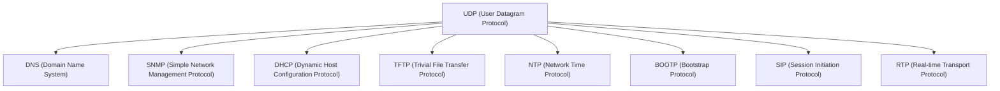
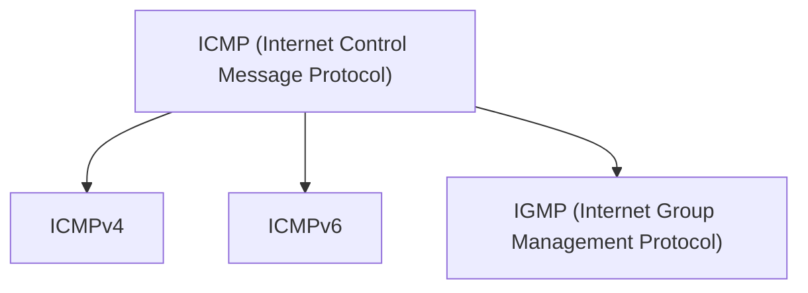
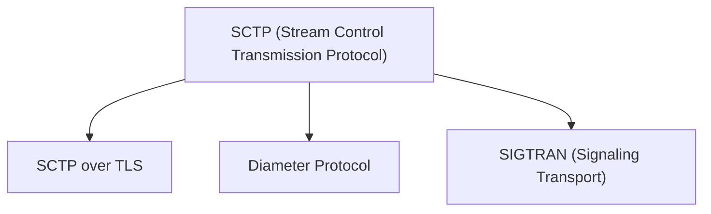
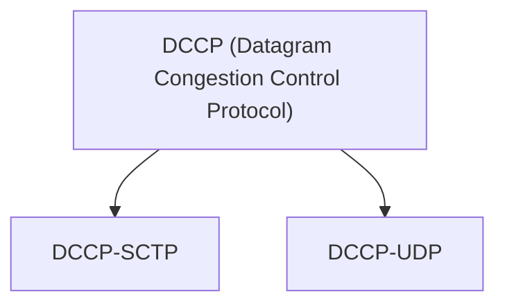

## Network Protocols Overview

Network protocols are a set of rules and conventions that govern communication between devices on a network. They define how data is formatted, transmitted, received, and interpreted across the network. These protocols ensure that devices can communicate effectively and reliably, regardless of their location or type.

### Commonly Used Protocols:

#### Transmission Control Protocol (TCP)
- **Description:** TCP is a connection-oriented protocol that provides reliable, ordered, and error-checked delivery of data packets between devices.
- **Usage:** Widely used for applications requiring guaranteed delivery of data, such as web browsing (HTTP), email transfer (SMTP, POP3, IMAP), and file transfer (FTP).

#### User Datagram Protocol (UDP)
- **Description:** UDP is a connectionless protocol that offers minimal overhead and low-latency communication but does not guarantee delivery or order of packets.
- **Usage:** Commonly used for real-time applications like streaming media (RTP), online gaming, VoIP (SIP), and DNS resolution.

#### Hypertext Transfer Protocol (HTTP)
- **Description:** HTTP is a protocol for transferring hypertext (structured text) between a client and a server over the World Wide Web.
- **Usage:** Fundamental for web browsing, allowing users to access and interact with web pages, download files, submit forms, and more.

#### Secure Shell (SSH)
- **Description:** SSH is a secure network protocol that provides encrypted communication between two computers, typically used for remote login or command execution.
- **Usage:** Commonly used by system administrators to securely access and manage remote servers and devices.

#### Domain Name System (DNS)
- **Description:** DNS is a hierarchical distributed naming system that translates domain names (e.g., example.com) into IP addresses.
- **Usage:** Essential for internet navigation, enabling users to access websites and services using human-readable domain names.

#### Simple Mail Transfer Protocol (SMTP)
- **Description:** SMTP is a protocol for sending email messages between servers, facilitating the delivery of emails across the internet.
- **Usage:** Integral to email communication, allowing users to send and receive emails through email clients and servers.

### Heirarchy:
Below are the tree heirarchy for the low-level network protocols on which our today's high level protocols stand.

#### TCP (Transmission Control Protocol) (Diagram)

```mermaid
graph TD;
    TCP["TCP (Transmission Control Protocol)"] -.-> HTTP["HTTP (Hypertext Transfer Protocol)"];
    TCP -.-> MQTT["MQTT (Message Queuing Telemetry Transport)"];
    TCP -.-> FTP["FTP (File Transfer Protocol)"];
    TCP -.-> Telnet["Telnet"];
    TCP -.-> SMTP["SMTP (Simple Mail Transfer Protocol)"];
    TCP -.-> SSH["SSH (Secure Shell)"];
    TCP -.-> POP3["POP3 (Post Office Protocol version 3)"];
    TCP -.-> IMAP["IMAP (Internet Message Access Protocol)"];
    TCP -.-> DNS["DNS (Domain Name System)"];
    TCP -.-> SNMP["SNMP (Simple Network Management Protocol)"];
    TCP -.-> HTTPS["HTTPS (HTTP Secure)"];
    TCP -.-> SIP["SIP (Session Initiation Protocol)"];
    TCP -.-> RTP["RTP (Real-time Transport Protocol)"];
    TCP -.-> SSL["TLS/SSL (Transport Layer Security/Secure Sockets Layer)"];
    TCP -.-> BitTorrent["BitTorrent"];
    TCP -.-> QUIC["QUIC (Quick UDP Internet Connections)"];
    TCP -.-> RTMP["RTMP (Real-Time Messaging Protocol)"];
    TCP -.-> RDP["RDP (Remote Desktop Protocol)"];
    TCP -.-> NFS["NFS (Network File System)"];
    TCP -.-> SMB["SMB (Server Message Block)"];
    TCP -.-> LDP["LDP (Label Distribution Protocol)"];
```

#### UDP (User Datagram Protocol) (Diagram)

#### ICMP (Internet Control Message Protocol) (Diagram)

#### SCTP (Stream Control Transmission Protocol) (Diagram)

#### DCCP (Datagram Congestion Control Protocol) (Diagram)

