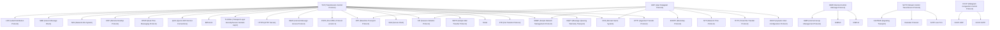

# protocol-tree

```mermaid
graph TD;
    TCP["TCP (Transmission Control Protocol)"] --> HTTP["HTTP (Hypertext Transfer Protocol)"];
    TCP --> MQTT["MQTT (Message Queuing Telemetry Transport)"];
    TCP --> FTP["FTP (File Transfer Protocol)"];
    TCP --> Telnet["Telnet"];
    TCP --> SMTP["SMTP (Simple Mail Transfer Protocol)"];
    TCP --> SSH["SSH (Secure Shell)"];
    TCP --> POP3["POP3 (Post Office Protocol version 3)"];
    TCP --> IMAP["IMAP (Internet Message Access Protocol)"];
    TCP --> DNS["DNS (Domain Name System)"];
    TCP --> SNMP["SNMP (Simple Network Management Protocol)"];
    TCP --> HTTPS["HTTPS (HTTP Secure)"];
    TCP --> SIP["SIP (Session Initiation Protocol)"];
    TCP --> RTP["RTP (Real-time Transport Protocol)"];
    TCP --> SSL["TLS/SSL (Transport Layer Security/Secure Sockets Layer)"];
    TCP --> BitTorrent["BitTorrent"];
    TCP --> QUIC["QUIC (Quick UDP Internet Connections)"];
    TCP --> RTMP["RTMP (Real-Time Messaging Protocol)"];
    TCP --> RDP["RDP (Remote Desktop Protocol)"];
    TCP --> NFS["NFS (Network File System)"];
    TCP --> SMB["SMB (Server Message Block)"];
    TCP --> LDP["LDP (Label Distribution Protocol)"];

    UDP["UDP (User Datagram Protocol)"] --> DNS;
    UDP --> SNMP;
    UDP --> DHCP["DHCP (Dynamic Host Configuration Protocol)"];
    UDP --> TFTP["TFTP (Trivial File Transfer Protocol)"];
    UDP --> NTP["NTP (Network Time Protocol)"];
    UDP --> BOOTP["BOOTP (Bootstrap Protocol)"];
    UDP --> SIP;
    UDP --> RTP;

    ICMP["ICMP (Internet Control Message Protocol)"] --> ICMPv4["ICMPv4"];
    ICMP --> ICMPv6["ICMPv6"];
    ICMP --> IGMP["IGMP (Internet Group Management Protocol)"];

    SCTP["SCTP (Stream Control Transmission Protocol)"] --> SCTP-TLS["SCTP over TLS"];
    SCTP --> Diameter["Diameter Protocol"];
    SCTP --> SIGTRAN["SIGTRAN (Signaling Transport)"];

    DCCP["DCCP (Datagram Congestion Control Protocol)"] --> DCCP-SCTP["DCCP-SCTP"];
    DCCP --> DCCP-UDP["DCCP-UDP"];
```
